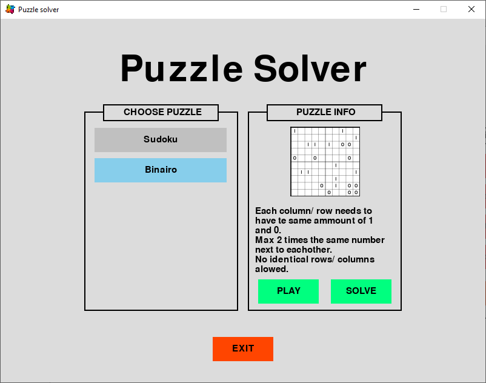
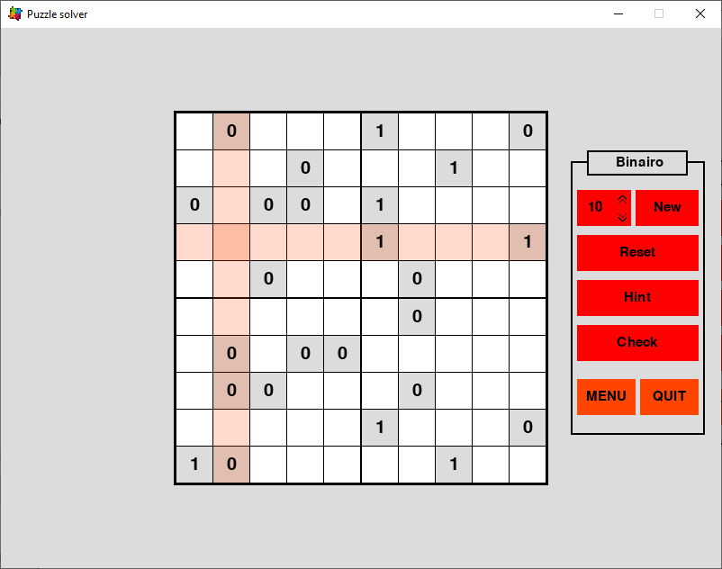

# Puzzle solver

## Requires:
  - python
  - pygame

## Content:

Pygame application:

  
  - Working:
    - Main menu
    - Binairo game
    
  - In Progess
    - Binairo Solver
    - Sudoku game
    - Sudoku Solver

Terminal only scripts:

  
  - script to solve sudoku's
  - script to solve binairo's
  - script to create binairo's
  

 
## Pygame application
### Main menu:

  - Choose the type of puzzle that you want to play
  - Get some info about the selected puzzle-type (picture, rules...)
  - "Play"-button: Play a randomly genereated puzzle
  - "Solve"-button: Imput a premade puzzleboard and let the app find the solution

### Sudoku:
#### Play/ Create
  - Work in progress
#### Solve
  - Work in progress
  
  
### Binairo:
#### Play/ Create

  - A random board (10 cubes) will be automatically created*
  - A new board of the desired size (2 - 14 cubes) can be created by changing the value and pressing "New"*
  - The board can be resetted to it's original state
  - The "Hint"-button will fill in a random empty cube
  - The "Check"-button:
      - removes all wrong values from the board
      - gives all correct values a grey cube-background
      - disables selection of the correct values so that they cant be changed anymore.
  - automatic highlighting of the selcted cube, row and column

Board generation can take a while depending on the selected board size.

#### Solve
  - Work in progress
